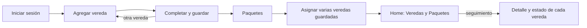

# 01 — Contexto

> Borrador v0.2 · 30/09/2026

## 1. Situación

En la ciudad de Colón (provincia de Buenos Aires) se relevan las veredas rotas de distintos sectores para organizar su reparación. Hoy esa información se registra en una planilla de Excel.

SistemaVeredas reemplaza la planilla por una aplicación web donde se cargan las veredas relevadas, se agrupan en paquetes para repararlas y se sigue el estado de cada una.

## 2. Proceso actual (antes del sistema)

1. **Relevamiento en la calle.** Una persona recorre los sectores de la ciudad, detecta veredas rotas, mide las roturas y saca fotos.
2. **Carga en Excel.** Vuelca lo relevado en una planilla: **un registro por vereda**, con los vínculos a sus fotos.

Hoy hay unas 500 veredas relevadas, cada una con al menos una foto y su ubicación. Esos datos **no se importan**: en el sistema publicado se carga todo desde cero (D-03).

## 3. Usuarios

- Hay un **único tipo de usuario** (un solo rol). Puede haber varios usuarios, todos con los mismos permisos.
- No hay registro público: a los usuarios nuevos los da de alta un usuario que ya inició sesión.
- Los proveedores (albañiles o contratistas) **no** son usuarios del sistema.

## 4. Flujo principal del sistema

1. El usuario inicia sesión.
2. Va a **Agregar vereda**.
3. Completa el formulario con los datos de la vereda relevada y la guarda.
4. Cuando tiene varias veredas cargadas, va a **Paquetes**.
5. Arma un paquete y le asigna, de una vez, varias de las veredas que cargó.
6. En el **Home** ve dos secciones, **Veredas** y **Paquetes**, y sigue usando el sistema para consultar cada vereda y el estado en que está.

A veces no se sabe a qué paquete va una vereda hasta juntar varias. Por eso la vereda se guarda sin paquete y se asigna después, cuando convenga (D-20).



## 5. Lógica corregida: medición y tipo de suelo

**Cómo estaba (incorrecto):** la medición se cargaba a través de Tipo de suelo. Cada "medición" era una fila aparte (tabla `Medicion`) con su tipo de suelo, largo y ancho.

**Cómo es:**

| Concepto | Qué es | Dónde se guarda |
|---|---|---|
| **Tipo de suelo** | Catálogo de los tipos de baldosa que hay en el mercado, con la medida de cada una (p. ej., 40x40). Nada más. | Tabla `TiposSuelo`. La vereda elige de esta lista; si falta uno, se agrega desde el mismo formulario. |
| **Medición** | Lo que mide la **rotura**: m² en la vereda, m³ en el cordón. No tiene relación con la medida de la baldosa. | Fórmula y total en `Veredas`; cada rotura en `Roturas` (D-29). |

Cada vereda tiene:

- **Medición** (los términos) y su **total en m²**, que el sistema calcula solo. Cada término es un **pozo** (rotura); la cantidad de pozos no tiene límite.
- **Un tipo de suelo por pozo**: al escribir los términos aparece un desplegable por cada pozo para elegir su tipo de suelo del catálogo (obligatorio). Dos pozos pueden tener el mismo tipo. El tipo de suelo solo identifica la baldosa: no interviene en ningún cálculo (D-26).
- **Cordón** (opcional): aparece al marcar la casilla **«Cordón»**, con su medición y su total en **m³**. No se muestra siempre porque los cordones son minoría (D-15).

Se guarda así: la tabla `Veredas` tiene la fórmula completa, el total en m² y el cordón; la tabla `Roturas` tiene una fila por rotura (pozo) con su orden, sus medidas, su tipo de suelo y su subtotal (D-29).

```
Medición  [(2*3)+(5*9)+(0,5*0,5)      ]

Pozo 1  2 × 3      = 6,00 m²   [Vainilla 0,20x0,20 ▼] [+ Nuevo]
Pozo 2  5 × 9      = 45,00 m²  [Cemento alisado    ▼]
Pozo 3  0,5 × 0,5  = 0,25 m²   [Vainilla 0,20x0,20 ▼]
Total              51,25 m²

[x] Cordón
  Medición cordón [(5*0,15*0,30)        ]
  Total cordón    0,225 m³
```

**Cómo se escribe una medición** (D-17, D-18):

- Es una suma de términos. Cada término es una rotura y se escribe como el producto de sus medidas en metros. No hay límite de términos.
- Solo suma (`+`) y multiplicación (`*`, o también `x`). Los paréntesis son opcionales.
- Se acepta coma o punto decimal.
- En m² cada término lleva **2 medidas** (largo × ancho); en m³ lleva **3** (largo × ancho × alto). Si un término no las tiene, el sistema avisa y no deja guardar. Así se detecta, por ejemplo, un `59` escrito en lugar de `5*9`.

| Caso | Medición | Total |
|---|---|---|
| Varios términos | `(2*3)+(5*9)+(4.5*8)+(2,4*4)+(3,75*9)` | 130,35 m² |
| Un solo término | `3*2` | 6 m² |
| Cordón | `(5*0,15*0,30)` | 0,225 m³ |
| Error de tipeo | `(2*3)+59` | Error: el término 2 tiene 1 medida y lleva 2 |

## 6. Glosario

| Término | Definición |
|---|---|
| Vereda | Registro de una vereda relevada. Hay uno por vereda (equivale a una fila de la planilla actual). |
| Relevamiento | Recorrida en la calle en la que se detectan, miden y fotografían las veredas rotas. |
| Rotura | Cada sector dañado dentro de una vereda. Una vereda puede tener varias. |
| Término (pozo) | Una rotura dentro de la medición: el producto de sus medidas, p. ej. `(2*3)`. Cada pozo tiene su tipo de suelo. |
| Medición | Suma de los términos de la vereda (en m²) o del cordón (en m³). |
| Cordón | Borde de la vereda junto a la calle. Su rotura se mide en m³. |
| Tipo de suelo | Tipo de baldosa del mercado con su medida. Es un catálogo; cada pozo usa uno. |
| Paquete | Grupo de veredas que se arma para organizar su reparación (p. ej., "Marzo (02) 2026"). |
| Proveedor | Albañil o contratista que repara las veredas. |
| Frentista | Vecino dueño del frente. Algunas veredas las arregla el frentista. |
| Estado | Situación de la vereda. Se elige de una lista fija (RN-12). |
| Prioridad | Baja, Media o Alta. |

## 7. Situación del desarrollo

Relevada sobre la copia local de Santiago (últimos cambios del 28/09/2026).

| Módulo | Situación |
|---|---|
| Acceso y usuarios | Hecho: inicio y cierre de sesión, ABM de usuarios y recuperación por mail (no funciona en el hosting gratuito). La contraseña de Gmail está escrita en `AccesController.cs` y el repositorio es público: hay que revocarla y sacarla del código. La página de inicio de sesión publicada se titula "ISFDyT N°124" y el mail de recuperación dice "WebTech". |
| Veredas | ABM con fotos, ubicación en mapa (OpenStreetMap), vista de Google Maps y Street View, filtro medidas / sin medir y detalle con la foto como protagonista. Falta el tipo de suelo en la vereda y hay que reemplazar la medición. |
| Tipos de suelo | ABM hecho. Falta el alta rápida desde el formulario de vereda. Hoy está ligado a Medición (a corregir). |
| Mediciones | Filas en una tabla aparte, cada una con tipo de suelo, sector, largo y ancho: **se reemplazan** por la lógica de la sección 5. |
| Paquetes | ABM hecho. Las veredas se asignan desde el formulario de cada vereda, de a una; falta asignar varias desde el paquete. |
| Proveedores | ABM hecho. |
| Home | Dos tarjetas (Veredas y Paquetes) con resumen y vistas en tarjetas. |
| Publicación | Sitio publicado en `gestorveredas.runasp.net` (responde por HTTPS), con Web Deploy desde la PC. |
