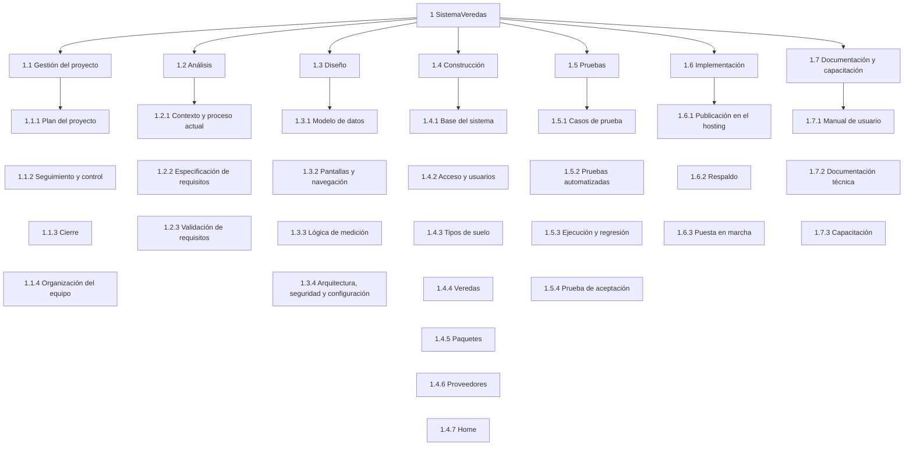

# 04 — EDT (Estructura de Desglose del Trabajo)

> Borrador v0.2 · 30/09/2026 · Se ajusta cuando se aprueben el alcance (02) y los requisitos (03).

La EDT divide todo el trabajo del proyecto en partes más chicas, hasta llegar a **paquetes de trabajo (PT)**: unidades que se pueden estimar, asignar y controlar. Lo que no está en la EDT no forma parte del proyecto.

Para no confundir con los *paquetes de veredas* del sistema, acá se usa siempre la sigla **PT**.

## 1. Vista general

## 2. Desglose completo

- **1 SistemaVeredas**
  - **1.1 Gestión del proyecto**
    - 1.1.1 Plan del proyecto
    - 1.1.2 Seguimiento y control
    - 1.1.3 Cierre
    - 1.1.4 Organización del equipo
  - **1.2 Análisis**
    - 1.2.1 Contexto y proceso actual
    - 1.2.2 Especificación de requisitos
    - 1.2.3 Validación de requisitos
  - **1.3 Diseño**
    - 1.3.1 Modelo de datos
    - 1.3.2 Pantallas y navegación
    - 1.3.3 Lógica de medición
    - 1.3.4 Arquitectura, seguridad y configuración
  - **1.4 Construcción**
    - 1.4.1 Base del sistema
    - 1.4.2 Acceso y usuarios
    - 1.4.3 Tipos de suelo
    - 1.4.4 Veredas
      - 1.4.4.1 Formulario de alta y edición
      - 1.4.4.2 Medición de roturas
      - 1.4.4.3 Fotos
      - 1.4.4.4 Ubicación y mapas
      - 1.4.4.5 Listado, búsqueda y filtros
      - 1.4.4.6 Detalle de vereda
    - 1.4.5 Paquetes
      - 1.4.5.1 ABM de paquetes
      - 1.4.5.2 Asignación de veredas
      - 1.4.5.3 Totales y avance
    - 1.4.6 Proveedores
    - 1.4.7 Home
  - **1.5 Pruebas**
    - 1.5.1 Casos de prueba
    - 1.5.2 Pruebas automatizadas
    - 1.5.3 Ejecución y regresión
    - 1.5.4 Prueba de aceptación
  - **1.6 Implementación**
    - 1.6.1 Publicación en el hosting
    - 1.6.2 Respaldo
    - 1.6.3 Puesta en marcha
  - **1.7 Documentación y capacitación**
    - 1.7.1 Manual de usuario
    - 1.7.2 Documentación técnica
    - 1.7.3 Capacitación

## 3. Diccionario de la EDT

**Situación** según la copia local del 28/09/2026 y el trabajo del 30/09.

| PT | Nombre | Qué incluye | Entregable | Criterio de aceptación | Situación |
|---|---|---|---|---|---|
| 1.1.1 | Plan del proyecto | Definir alcance, EDT y cronograma, y mantenerlos al día. | 02 y 04 aprobados, y cronograma. | Alcance y EDT aprobados; cada PT con estimación y fecha. | En curso |
| 1.1.2 | Seguimiento y control | Revisar avances y registrar decisiones, riesgos y cambios de alcance. | 05 y 07 actualizados. | Todo cambio de alcance queda registrado como decisión. | En curso |
| 1.1.3 | Cierre | Aceptación final y lecciones aprendidas. | Acta de aceptación. | El responsable da por aceptado el sistema. | A hacer |
| 1.1.4 | Organización del equipo | Roles del equipo (agentes), flujo de trabajo, Definición de Listo y de Hecho. | `.claude/agents/`, `CLAUDE.md` y 06. | Cada rol tiene responsabilidades, entregables y límites claros. | Hecho (v0.1) |
| 1.2.1 | Contexto y proceso actual | Problema, proceso actual, usuarios, flujo y glosario. | 01-contexto.md | Aprobado por el responsable. | Borrador v0.2 |
| 1.2.2 | Especificación de requisitos | Requisitos funcionales, no funcionales y reglas de negocio. | 03-requisitos.md | Cada requisito tiene ID, prioridad y estado. | Borrador v0.2 |
| 1.2.3 | Validación de requisitos | Responder las preguntas de 05 y aprobar los requisitos. | 03 y 05 aprobados. | Ningún requisito "Debe" queda "A confirmar". | En curso |
| 1.3.1 | Modelo de datos | Entidades, relaciones y tipos de datos, con la corrección de medición y tipo de suelo. | Specs del sprint y diagrama entidad-relación. | Cubre los RF "Debe" y la migración se aplica sin errores. | En curso (SPEC-001) |
| 1.3.2 | Pantallas y navegación | Bocetos de las pantallas clave: formulario de vereda, asignación de veredas al paquete y Home. | Bocetos. | Aprobados antes de construir. | Parcial |
| 1.3.3 | Lógica de medición | Formato de escritura, validaciones y cálculo. | SPEC-001 con ejemplos. | Los ejemplos de 01 dan el total esperado. | En curso (SPEC-001) |
| 1.3.4 | Arquitectura, seguridad y configuración | Capas y servicios, manejo de claves, sesión y configuración por ambiente. | Descripción técnica y SPEC-003. | Cumple RNF-04, RNF-05, RNF-06 y RNF-07. | Parcial |
| 1.4.1 | Base del sistema | Solución, layout, conexión a SQL Server y migraciones. | Proyecto que compila y crea la base. | Compila y aplica las migraciones sin errores. | Hecho |
| 1.4.2 | Acceso y usuarios | Inicio y cierre de sesión, ABM de usuarios, recuperación y largo de la contraseña. | Módulo funcionando. | Cumple RF-ACC-01 a RF-ACC-06 y RN-16. | Hecho (falta: RN-16, credenciales fuera del código y RNF-05) |
| 1.4.3 | Tipos de suelo | ABM del catálogo y alta rápida desde la vereda. | Módulo funcionando. | Cumple RF-TSU-01, RF-VER-06 y RN-13. | Parcial (falta el alta rápida) |
| 1.4.4.1 | Formulario de alta y edición | Datos de la vereda, tipo de suelo, estado y prioridad; edición y baja. | Formulario funcionando. | Cumple RF-VER-01, RF-VER-05, RF-VER-13, RF-VER-14 y RF-VER-15. | Parcial (falta el tipo de suelo en la vereda) |
| 1.4.4.2 | Medición de roturas | Tipo de suelo 1 y 2 con su medición en m², casilla Cordón con su medición en m³, cálculo y validación. | Medición funcionando, con pruebas. | Cumple RF-VER-07, RF-VER-08, RF-VER-09, RF-VER-16, RN-05 a RN-09, RN-15 y RN-17. | A corregir (hoy: filas en tabla aparte) |
| 1.4.4.3 | Fotos | Subir, ver y quitar fotos; achicarlas al subir. | Manejo de fotos. | Cumple RF-VER-04 y RNF-12. | Hecho (falta achicarlas) |
| 1.4.4.4 | Ubicación y mapas | Elegir el punto en el mapa; ver Google Maps y Street View. | Mapas funcionando. | Cumple RF-VER-02 y RF-VER-03. | Hecho (probar en el sitio publicado) |
| 1.4.4.5 | Listado, búsqueda y filtros | Buscador y filtros del listado de veredas. | Listado. | Cumple RF-VER-10 y RF-VER-11. | Hecho con la medición vieja (a adaptar) |
| 1.4.4.6 | Detalle de vereda | Foto protagonista, panel de datos, totales, mapa y Street View. | Vista de detalle. | Cumple RF-VER-12 y RF-VER-17. | Hecho (a adaptar a la nueva medición) |
| 1.4.5.1 | ABM de paquetes | Crear, listar, editar y eliminar paquetes. | ABM funcionando. | Cumple RF-PAQ-01, RF-PAQ-05, RF-PAQ-06 y RF-PAQ-07. | Hecho |
| 1.4.5.2 | Asignación de veredas | Asignar varias veredas guardadas desde el paquete (y desde el listado) y quitarlas. | Pantalla de asignación. | Cumple RF-PAQ-02, RF-PAQ-03, RF-PAQ-08, RN-10 y RN-18. | A hacer (hoy se asigna desde cada vereda) |
| 1.4.5.3 | Totales y avance | Cantidad de veredas, m², m³ y % de avance. | Detalle del paquete. | Cumple RF-PAQ-04. | Parcial (falta m³ y el detalle) |
| 1.4.6 | Proveedores | ABM de proveedores. | ABM funcionando. | Cumple RF-PRO-01. | Hecho (alcance: P-12) |
| 1.4.7 | Home | Secciones Veredas y Paquetes con resumen. | Home. | Cumple RF-HOM-01. | Hecho (a adaptar a la nueva medición) |
| 1.5.1 | Casos de prueba | Casos escritos desde los requisitos y las specs, con trazabilidad. | `Specs/pruebas/casos-de-prueba.md` | Todo requisito "Debe" del sprint tiene al menos un caso. | En curso (sprint 1) |
| 1.5.2 | Pruebas automatizadas | Proyecto `SistemaVeredas.Tests`: pruebas unitarias e integración. | Proyecto de pruebas. | Todas pasan, incluidos los ejemplos de 01. | A hacer |
| 1.5.3 | Ejecución y regresión | Ejecutar los casos, registrar defectos y volver a probar. | `Specs/pruebas/ejecuciones/` y `defectos.md`. | Ningún defecto crítico o alto abierto. | A hacer |
| 1.5.4 | Prueba de aceptación | Recorrer el flujo principal completo con el usuario. | Registro de la prueba. | El flujo de 01 se completa sin errores en el sitio publicado. | A hacer |
| 1.6.1 | Publicación en el hosting | Publicar sitio y base en MonsterASP.NET; configurar claves y el dominio en la API key de Google. | Sitio publicado. | Funciona en `gestorveredas.runasp.net`. | Hecho (se republica en cada entrega) |
| 1.6.2 | Respaldo | Procedimiento para copiar la base y las fotos. | Procedimiento escrito y una copia restaurada de prueba. | Se restaura una copia sin pérdida de datos. | A hacer |
| 1.6.3 | Puesta en marcha | Crear los usuarios iniciales y cargar el catálogo de tipos de suelo. | Sistema listo para cargar veredas. | Usuarios activos y catálogo cargado. | Parcial (falta el catálogo) |
| 1.7.1 | Manual de usuario | Guía breve del flujo principal, con capturas. | Manual. | Un usuario nuevo completa el flujo con el manual. | A confirmar |
| 1.7.2 | Documentación técnica | Modelo de datos, configuración y cómo publicar. | Documento en Docs. | Permite volver a publicar desde cero. | A hacer |
| 1.7.3 | Capacitación | Explicar el sistema a los usuarios. | Sesión de capacitación. | Los usuarios cargan una vereda y arman un paquete sin ayuda. | A confirmar |

## 4. Sprint 1

El detalle está en `Docs/07-backlog.md`. Abarca:

- **Medición y tipos de suelo** (SPEC-001): PT 1.3.1, 1.3.3, 1.4.3, 1.4.4.1, 1.4.4.2, 1.4.4.5, 1.4.4.6 y 1.4.7.
- **Asignación de veredas a paquetes** (SPEC-002): PT 1.4.5.2 y 1.4.5.3.
- **Contraseña y credenciales fuera del código** (SPEC-003): PT 1.3.4 y 1.4.2.
- **Pruebas:** PT 1.5.1, 1.5.2 y 1.5.3.

## 5. Próximos pasos

1. Responder las preguntas que quedan en 05 y aprobar los requisitos.
2. Ajustar y aprobar esta EDT.
3. Estimar cada PT y armar el cronograma (P-18).
