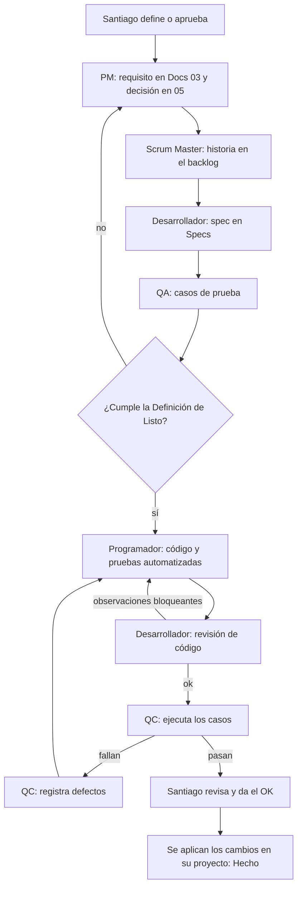

# 06 — Equipo y flujo de trabajo

> v0.1 · 30/09/2026

## 1. Roles

| Rol | Quién | Responsable de | Produce | No hace |
|---|---|---|---|---|
| Product Owner / cliente | Santiago | Decidir qué se construye, priorizar y aceptar. | Respuestas y aprobaciones | — |
| Project Manager | agente `project-manager` | Alcance, EDT, cronograma, riesgos y registro de decisiones. | Docs 02, 04 y 05 | Código |
| Scrum Master | agente `scrum-master` | Backlog, sprints, historias, Definición de Listo y de Hecho, impedimentos. | Docs 07 | Código |
| Desarrollador | agente `desarrollador` | Diseño técnico y revisión de código. | `Specs/SPEC-nnn` y revisiones | La implementación completa |
| Programador | agente `programador` | Implementar las specs con sus pruebas y corregir defectos. | Código y `SistemaVeredas.Tests` | Cambiar el alcance |
| Tester QA | agente `tester-qa` | Estrategia y casos de prueba a partir de los requisitos. | `Specs/pruebas/casos-de-prueba.md` | Ejecutar pruebas |
| Tester QC | agente `tester-qc` | Ejecutar pruebas, registrar defectos, regresión y veredicto. | `Specs/pruebas/ejecuciones/` y `defectos.md` | Corregir código |

Claude coordina al equipo: le pasa a cada agente lo que necesita y le presenta los resultados a Santiago. Las definiciones de los agentes están en `.claude/agents/`.

## 2. Flujo de una historia

## 3. Definición de Listo (para empezar a programar)

- Los requisitos de la historia están en `Confirmado`.
- La spec está aprobada.
- Los casos de prueba están escritos.
- No hay preguntas abiertas que la bloqueen.

## 4. Definición de Hecho (para cerrar una historia)

- Compila sin errores.
- Las pruebas automatizadas están en verde.
- QC ejecutó los casos de la historia y pasan todos (o Santiago acepta los defectos menores que queden).
- La revisión del Desarrollador no tiene observaciones bloqueantes.
- Docs y Specs están actualizados.
- Santiago dio el OK y los cambios están aplicados en su proyecto.

## 5. Ciclo de un defecto

`Nuevo` → `Corregido` (programador) → `Verificado` (QC). Si vuelve a fallar: `Reabierto` → `Corregido` → …

| Severidad | Criterio |
|---|---|
| Crítica | Bloquea el uso del sistema o pierde datos. |
| Alta | Una función principal no anda. |
| Media | Anda, pero con error o con un rodeo. |
| Baja | Detalle visual o de texto. |

## 6. Entorno de pruebas

- **Compilación y pruebas automatizadas:** en la PC de Santiago. Claude abre una terminal con control de pantalla y corre `dotnet build` y `dotnet test`; la salida se guarda en `TestResults/` (ignorada por git) para leerla completa.
- **Base de datos:** una base de pruebas aparte. Nunca la base real ni el sitio publicado.
- **Pruebas E2E:** la app corriendo en la PC (`https://localhost:7243`) y el navegador integrado de la app de Claude.
- Mientras corre una ronda de pruebas, Santiago no usa la PC.

## 7. Cómo pedirle algo a un agente

En una conversación con Claude sobre este proyecto, por ejemplo:

- "Que el agente `tester-qa` escriba los casos de SPEC-004."
- "Que el `tester-qc` corra la regresión completa."
- "Que el `desarrollador` revise los cambios del programador."
